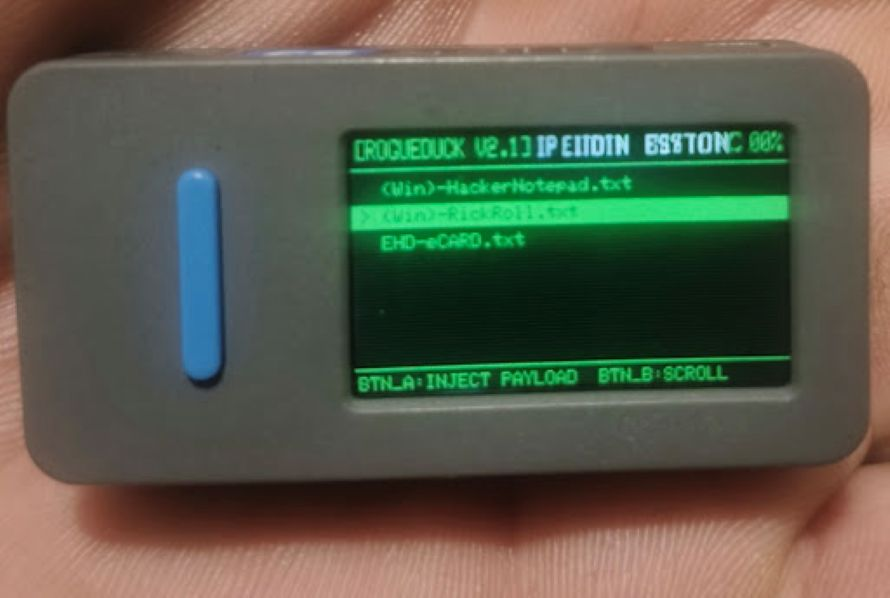
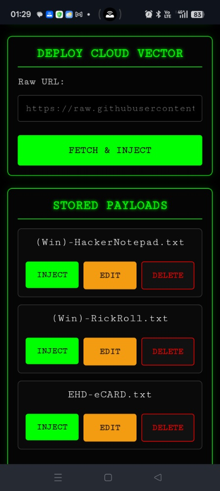
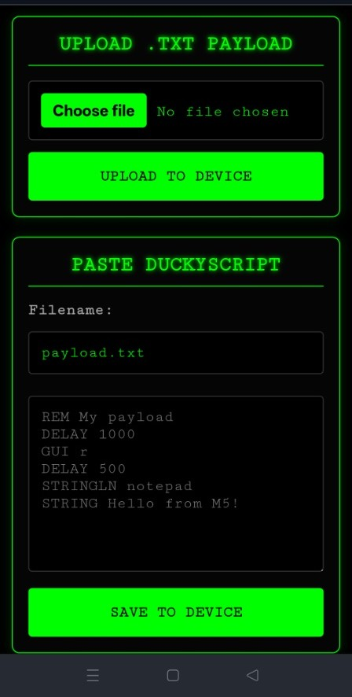
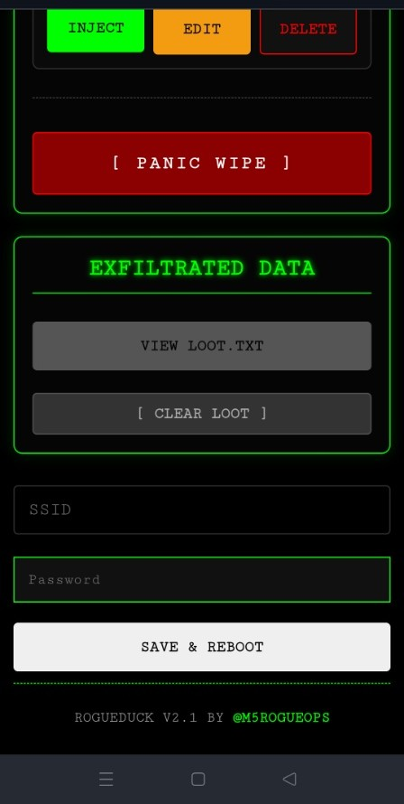

# 🦆 ROGUEDUCK V2.1 (Now Be Free My Precious)
**Advanced USB HID Remote Wi-Fi Ducky Payload Injector for M5Stack StickS3**

```text
 ██████╗  ██████╗  ██████╗ ██╗   ██╗███████╗██████╗ ██╗   ██╗ ██████╗██╗  ██╗
 ██╔══██╗██╔═══██╗██╔════╝ ██║   ██║██╔════╝██╔══██╗██║   ██║██╔════╝██║ ██╔╝
 ██████╔╝██║   ██║██║  ███╗██║   ██║█████╗  ██║  ██║██║   ██║██║     █████╔╝ 
 ██╔══██╗██║   ██║██║   ██║██║   ██║██╔══╝  ██║  ██║██║   ██║██║     ██╔═██╗ 
 ██║  ██║╚██████╔╝╚██████╔╝╚██████╔╝███████╗██████╔╝╚██████╔╝╚██████╗██║  ██╗
 ╚═╝  ╚═╝ ╚═════╝  ╚═════╝  ╚═════╝  ╚══════╝╚═════╝  ╚═════╝  ╚═════╝╚═╝  ╚═╝

```

ROGUEDUCK V2.1 is a custom, tactical firmware that transforms the M5Stack StickS3 into a covert, dual-network BadUSB tool. It features a complete mobile-first web interface, on-the-fly DuckyScript parsing, cloud-payload fetching, and a cyberpunk CRT hardware UI.

---

## 🚀 Key Features

### 🌐 Dual-Mode Networking (AP + STA)

* **Station Mode (STA):** Automatically attempts to connect to a predefined mobile hotspot or local network for internet-enabled attacks.
* **Access Point (AP) Fallback:** Always broadcasts its own isolated `RogueDuck_Sync` network so you are never locked out of the command center.
* **Captive Portal:** A built-in DNS server in AP mode intercepts network traffic, forcing the connecting device's web browser to automatically pop up the Command Center.
* **Global Cloud Tunneling:** Includes a Python companion script (`rogueduck_tunnel.py`) to bridge the local M5Stack to the internet via Cloudflare or Ngrok, allowing you to control the device and trigger payloads from anywhere in the world.

### 📱 Mobile-First Web Command Center

A stealthy, dark-mode web application optimized for fat-thumb operation on smartphones.

* **Over-The-Air Uploads:** Push `.txt` DuckyScript payloads directly to internal storage (LittleFS).
* **Live Editor:** Write, edit, and save payloads directly from your mobile browser.
* **Cloud Vector Deployment:** Paste a raw URL (e.g., GitHub Raw, Pastebin) to fetch and execute a payload entirely in RAM, leaving no trace on the device's physical storage.
* **Remote Execution:** Trigger any stored payload instantly from the web app.
* **Panic Wipe:** A dedicated killswitch at the bottom of the UI that formats the LittleFS partition, permanently wiping all stored payloads in seconds.
* **Tactical Data Exfiltration:** Securely transmit stolen data (passwords, keys, tokens) from the target machine directly to the RogueDuck via `Invoke-RestMethod`. Stored loot is centralized, viewable in the web UI, and manageable in real-time.
* **Loot Management:** A dedicated dashboard to view, ignore, or perform a mass wipe of exfiltrated data files with a single click.

### 📟 Hardware Interface

* **Cyberpunk CRT Aesthetic:** Simulated CRT scanlines, dynamic glitch effects during injection, and dynamic IP rendering.
* **Pocket Lock & Battery Saver:** Long-press the side button to dim the screen and disable the physical injection buttons, preventing accidental misfires in your pocket.
* **Live Telemetry:** Real-time battery percentage monitoring directly on the header.

---

## 📸 Interface Overview

<div align="center">
  <table>
    <tr>
      <th align="center">Device Hardware</th>
      <th align="center">File & Cloud Operations</th>
    </tr>
    <tr>
      <td></td>
      <td></td>
    </tr>
    <tr>
      <td align="center"><i>Cyberpunk CRT Hardware UI</i></td>
      <td align="center"><i>Cloud Vector & Local Storage</i></td>
    </tr>
  </table>

  <table>
    <tr>
      <th align="center">Payload Creation</th>
      <th align="center">Tactical Exfiltration</th>
    </tr>
    <tr>
      <td></td>
      <td></td>
    </tr>
    <tr>
      <td align="center"><i>OTA DuckyScript Editor</i></td>
      <td align="center"><i>Loot Dashboard & Network Setup</i></td>
    </tr>
  </table>
</div>

---

## 🛠️ Hardware Requirements

* **Device:**  M5Stack StickS3 - Product Docs/Purchase:  [M5Stack StickS3 (ESP32-S3)](https://www.ethicalhackersden.org/p/go.html?url=https://shop.m5stack.com/products/m5sticks3-esp32s3-mini-iot-dev-kit) 
* **Connection:** USB-C (For flashing and HID emulation)

---

## ⚙️ Installation & Flashing

If you Don't want to mess with code, and enjoy its beauty, you can just download the latest .bin files.

* M5Stack M5Burner - [View Download And Docs Here!](https://docs.m5stack.com/en/download)
* M5Launcher By  bmorcelli - Github: [View Source Here!](https://github.com/bmorcelli/Launcher)  - Web: [Flash Firmware Here!](https://bmorcelli.github.io/Launcher/)


### 1. Dependencies

Ensure you have the following libraries installed in the Arduino IDE:

* `M5Unified`
* `LittleFS`
* `USB`
* `USBHIDKeyboard`
* `HTTPClient`
* `WebServer`

### 2. Configuration & First-Boot

Unlike previous builds, Wi-Fi Station configurations no longer need to be hard-coded into the source code before compilation.

1. Flash the firmware using the instructions below.
2. Power on the device. It will spin up the `RogueDuck_Sync` Access Point automatically.
3. Connect your smartphone to the network `defult password: 12345678` and allow the Captive Portal to load, or visit `http://192.168.4.1/`.
4. Scroll to the **Wi-Fi Configuration** section at the bottom, input your permanent hotspot credentials Eg. Your mobile hotspot. and select **SAVE & REBOOT**.

### 3. CRITICAL: Partition Scheme

Because this firmware utilizes heavy web assets, dual Wi-Fi, and HTTP clients, it exceeds the default 1.2MB ESP32 application limit.

* In Arduino IDE, navigate to **Tools > Partition Scheme**.
* Select **Huge APP (3MB No OTA/1MB SPIFFS)** or **No OTA (2MB APP/2MB SPIFFS)**.
* Compile and Upload.

---

## 🕹️ Operation Guide

### Physical Controls

* **Button A (Front):** `INJECT PAYLOAD` - Executes the currently selected payload.
* **Button B (Side Short-Click):** `SCROLL` - Cycles through stored payloads.
* **Button B (Side Long-Press):** `POCKET LOCK` - Toggles the battery-saver dim mode and locks the physical execution buttons.

### Web Controls

1. Connect your smartphone/PC to either the `RogueDuck_Sync` Wi-Fi network OR the configured Hotspot network.
2. Check the M5StickS3's physical screen for the assigned **IP Address**.
3. Enter the IP into your web browser.
4. Use the GUI to upload, edit, fire, view loot, or wipe payloads.

---

## 📜 Supported DuckyScript 1.0 Syntax

The internal parser processes standard US-English layout DuckyScript 1.0 commands:

* `STRING` / `STRINGLN`
* `DELAY` / `DEFAULT_DELAY`
* `GUI` / `WINDOWS` / `COMMAND`
* `CTRL`, `SHIFT`, `ALT` (and combos like `CTRL-ALT-DELETE`)
* `ENTER`, `TAB`, `SPACE`, `ESC`, `UP`, `DOWN`, `LEFT`, `RIGHT`
* `F1` - `F12`
* `REM` (Comments)
* `REPEAT`

---

## 📋 To-Do / Roadmap

* [x] **Captive Portal:** Implement a DNS server in AP mode so connecting to the `RogueDuck_Sync` Wi-Fi automatically opens the Web UI.
* [x] **Tunneling Companion Guide:** Add documentation and a companion Python script for setting up Ngrok/Cloudflare reverse tunneling for global access.
* [x] **Data Exfiltration:** Add a listener endpoint to capture keystrokes or data from the target machine and save it to `LittleFS`.
* [ ] **International Keyboard Layouts:** Expand character mapping beyond US English to support UK, DE, FR, and ES layouts.
* [ ] **Onboard SD Card Storage:** Integrate support for external SD hardware configurations.

---

## 🛡️ Credits & Disclaimer

**ROGUEDUCK V2.1 by [@M5RogueOps**](https://github.com/M5RogueOps) **Powered by [Ethical Hackers Den**](https://www.ethicalhackersden.org)

*This tool is designed for educational purposes, authorized penetration testing, and personal research. The developers assume no liability and are not responsible for any misuse or damage caused by this firmware. Only operate on networks and devices you have explicit permission to test.*

---

```

